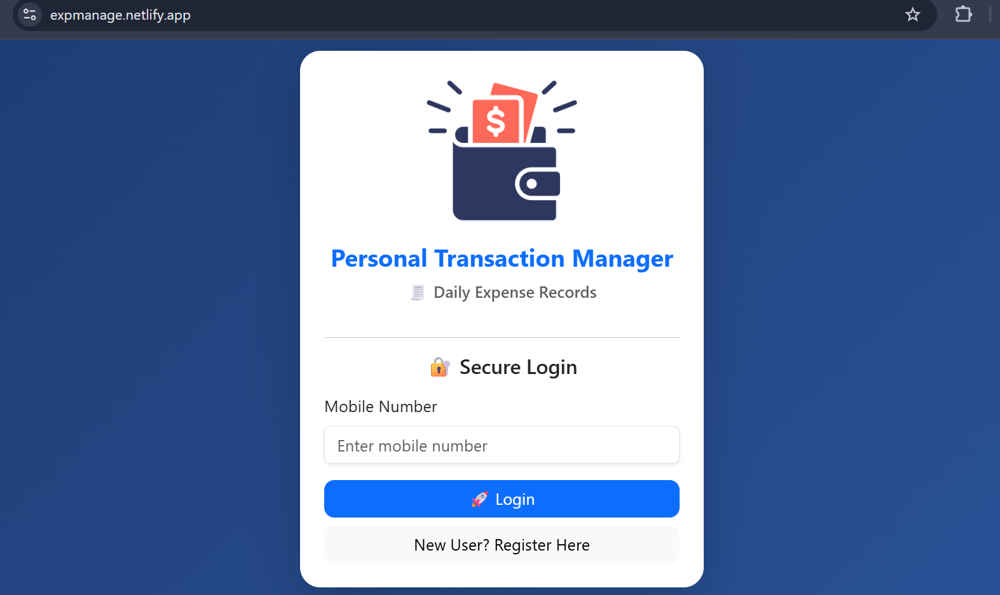
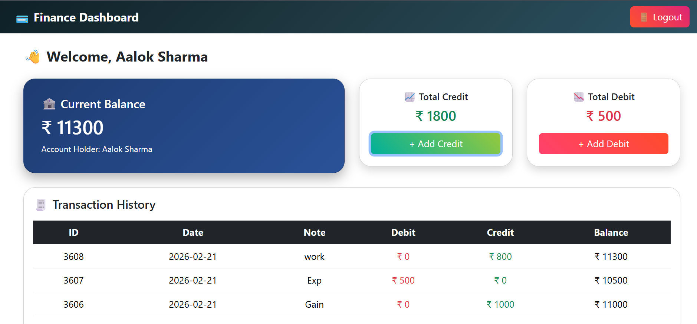
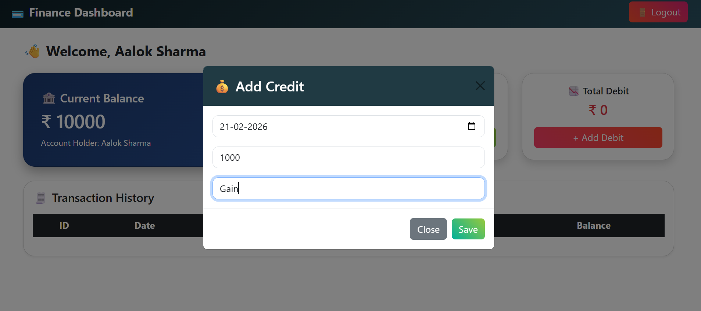
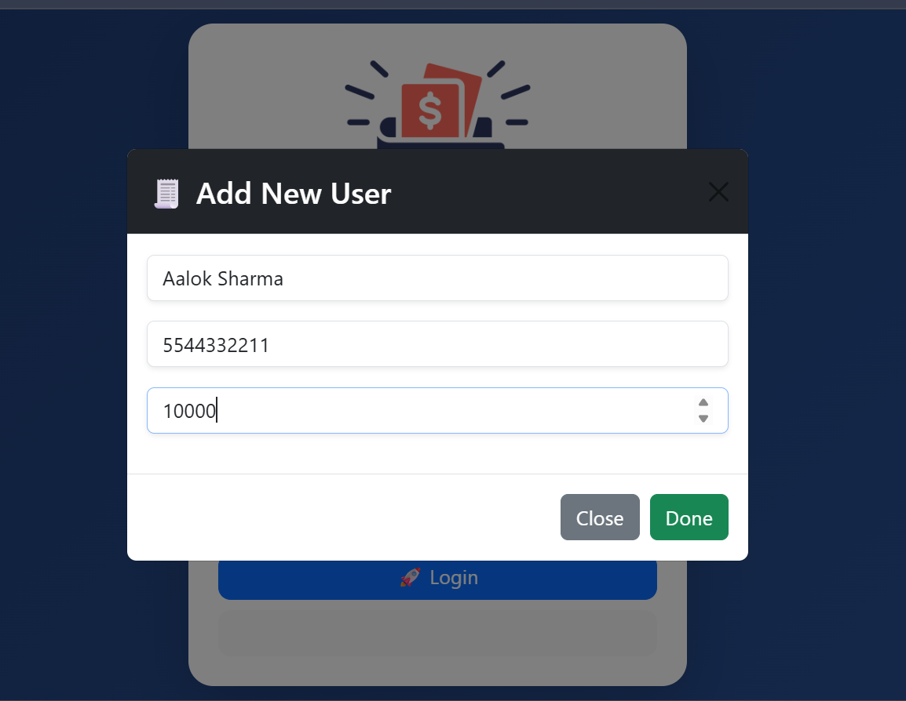

🚀 Personal Transaction Manager
💰 Smart Financial Tracking Web Application
🌐 Live Demo

🔗 https://expmanage.netlify.app

📌 Project Overview

Personal Transaction Manager is a modern financial dashboard web application that allows users to:

🔐 Secure Login

💰 View Opening Balance

📈 Track Total Credit

📉 Track Total Debit

🧾 View Complete Transaction History

➕ Add Credit / Debit Entries

🚪 Logout Securely

It is designed like a real fintech dashboard with a modern UI and professional layout.

🖼️ Project Screenshots
🔐 Login Page

📊 Finance Dashboard

➕ Add Credit Modal

📜 Add New User

🛠️ Tech Stack
💻 Frontend

⚛️ React JS (Vite)

🎨 React Bootstrap

📦 Axios

🧠 Context API

🌈 Custom CSS (Glassmorphism + Gradient UI)

🌐 Backend API

PHP REST API

MySQL Database

🚀 Deployment

Netlify (Frontend)

Remote PHP Server (Backend API)

✨ Features
🔹 Authentication

Login using mobile number

Session stored using LocalStorage

Context API for global user state

🔹 Financial Dashboard

Current Balance Card

Total Credit Summary

Total Debit Summary

Modern Gradient UI

Financial Emoji Integration 💰📊📈

🔹 Transaction Management

Add Credit

Add Debit

Real-time Total Calculation

Dynamic Transaction Table

Running Closing Balance
